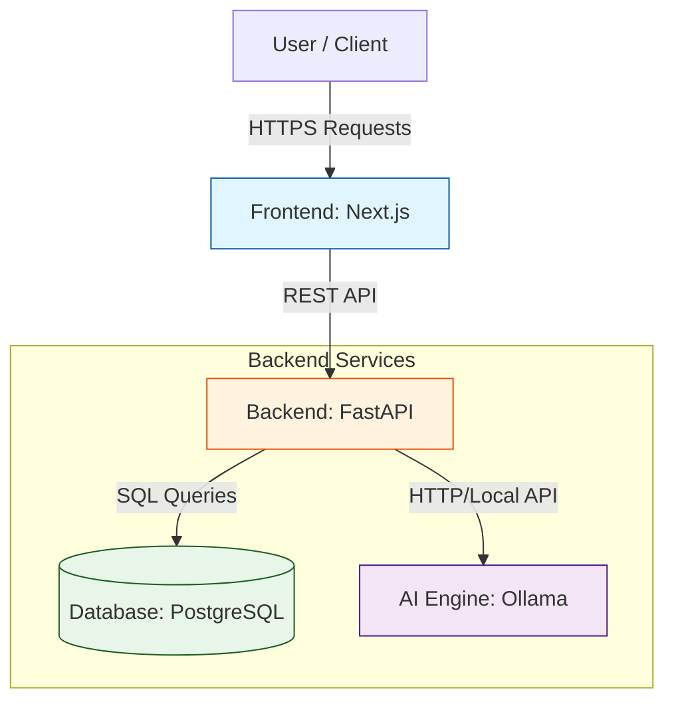

System Architecture Diagram:

    

Components Descriptions:

(Frontend) Next.js: 
Handles user interactions, renders the schedule grids, and will capture the natural language input.

(Backend) FastAPI: 

Connects the user, PostgreSQL database, and Ollama.  

(Local AI) Ollama: 

It is utilized for processing natural language input.

(Database) PostgreSQL: 

Stores Groups, Stores User Schedules

Data Flow Schematic:

Diagram
    U as User
    FE as Next.js
    BE as FastAPI
    AI as Ollama
    DB as PostgreSQL

    U->>FE: Enters "I am free Thursday Nights"
    FE->>BE: POST /parse-schedule
    BE->>AI: Prompt: "Convert text to JSON"
    AI-->>BE: Returns { "Thursday": "19:00-23:59" }
    BE->>DB: Insert into Schedules table
    DB-->>BE: Success
    BE-->>FE: 200 OK (Schedule Updated)
    FE-->>U: Shows updated calendar grid

ADRs (Architectural Decision Records):

ADR 001: Local LLM vs Cloud API

Status: Accepted

Context: We need to parse natural language into structured data. Choices are a paid API like OpenAI or a local model like Ollama.

Decision: We will utilize Ollama running locally on our machines.

Consequences: The LLM used for this project will require sufficient RAM and Storage to run the model.

ADR 002: Backend Framework Selection

Status: Accepted

Context: A backend is required to handle API requests and interface with the LLM. Options include Spring Boot, FastAPI, Django, etc.

Decision: FastAPI will be utilized.

Consequences: The team has to understand Python type hinting and Pydantic models.

